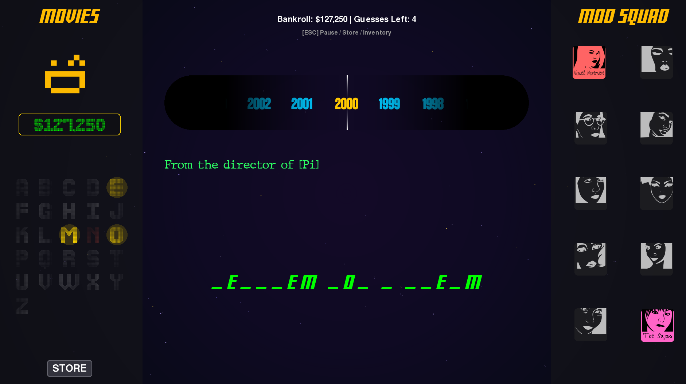

# Table of Contents

-   [Syllable Syndicate, a word game.](#orga5c34a6)
-   [Features](#orgefb0611)
-   [Demo](#orgc5d5f75)
-   [Requirements](#requirements)
-   [Installation](#org5e8a8a9)
-   [License](#org34c2334)
-   [Acknowledgments](#orgb797d43)

# Syllable Syndicate, a word game.

A hangman-style word guessing game with modifiers written in Python.

# Features

-   Modular Design
-   Dynamic image rendering
-   Cross platform availability

# Demo

There are sound quality issues running in a browser. On windows, the exe is much better. Or compile it.

[Live Demo](https://appeasing3666.itch.io/syllable-syndicate)

# Requirements

<table border="2" cellspacing="0" cellpadding="6" rules="groups" frame="hsides">

<colgroup>
<col  class="org-left" />

<col  class="org-left" />

<col  class="org-left" />
</colgroup>
<thead>
<tr>
<th scope="col" class="org-left">Dependency</th>
<th scope="col" class="org-left">Version</th>
<th scope="col" class="org-left">Notes</th>
</tr>
</thead>
<tbody>
<tr>
<td class="org-left">Python</td>
<td class="org-left">&gt;= 3.10</td>
<td class="org-left">Core runtime</td>
</tr>

<tr>
<td class="org-left">Pygame</td>
<td class="org-left">&gt;= 2.5</td>
<td class="org-left">Game engine</td>
</tr>
</tbody>
</table>

# Installation

Clone this repo, pip install pygame (or install for your environment). Then run python3 main.py

**Note** Windows users should use Python versions 3.11 or 3.12

# License

This project is licensed under the MIT License — see the [LICENSE](LICENSE) file for details.

# Acknowledgments

All attributions are located under the assets directory

